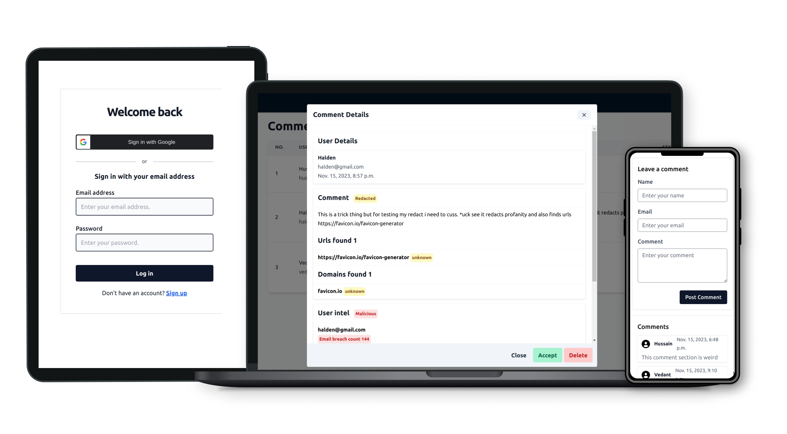

## Pommento
Secure comment service using pangea

[Youtube](https://youtu.be/foHdaPlQCyI)


## Table of Contents
- [Pommento](#pommento)
- [Table of Contents](#table-of-contents)
- [Create Virtual environment](#create-virtual-environment)
- [Built with](#built-with)
- [What I learned](#what-i-learned)
- [Continued development](#continued-development)
- [Author](#author)

## Create Virtual environment

After cloning the repo you need to create a Virtual environment using the following command and install the requirements.txt


```bash
python -m venv venv
```
Open cli in the folder of the cloned repo and then create env
```bash
source venv/bin/activate
```
Then insatll requirements 
```bash
pip install -r requirements.txt
```
You would need to setup the .env file in the root directory before running the project. You can look at example-env.txt for setting it up.

Then start the local setup using
```bash
python src/manage.py runserver
```
>The admin user creds are prefilled in the login page for testing. 

>For testing the comment-widget there is widget_test.html. Update it with the required parameters.


And for development and making changes also use
```bash
python src/manage.py taiwlind install
python src/manage.py taiwlind start
```
Apart from this you will also have to run the stripe webhook locally for testing and properly update the google oauth path and uri in google cloud console for the google login/register button to work.


## Built with
- [Django](https://www.djangoproject.com/) - High-level Python web framework
- [Alpine.js](https://alpinejs.dev/)
- [Htmx](https://htmx.org/)
- Tailwind, [kutty plugin ](https://kutty.netlify.app/)
- Stripe


## What I learned
Pangea is an amazing tool that provides a wide range of services and they have a solid documentation that can be easily understood by anybody. 

I made use of https://github.com/pangeacyber/pangea-python/tree/main/examples these examples to add the pangea api for different services in my project.

Also this https://pangea.cloud/docs/tutorials/django/ tutorial helped a lot.

The project made me realize that for you to develop a feature you need to properly plan out your time and focus on the most important parts otherwise you will be lost in the details.

## Continued development

I am using this section to outline areas that I want to continue focusing on in future for this project. 

**Tasks To Do**
- [ ] Add a page view filter 
- [ ] Add more security to the comment widget
- [ ] Update the stripe billing to handle reactivation and cancellation of subscription

## Author

- Profile - [Hussain Shaikh](https://www.linkedin.com/in/hussainshk/)
- Twitter - [@HussainSk2001](https://twitter.com/HussainSk2001)

